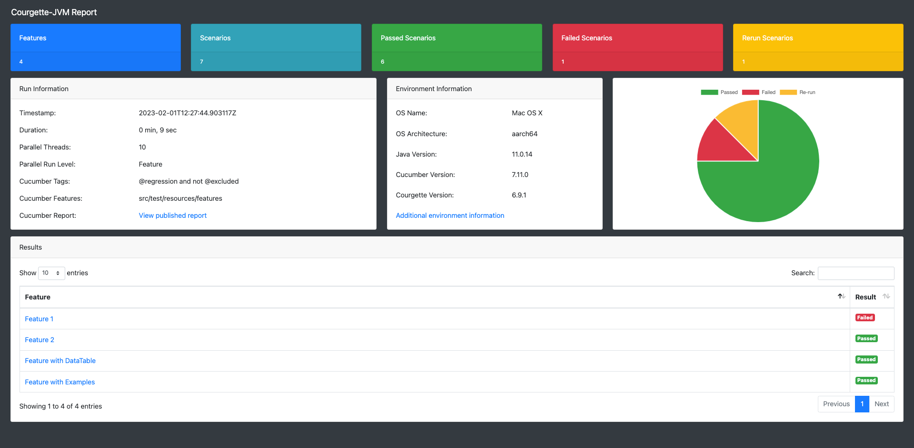
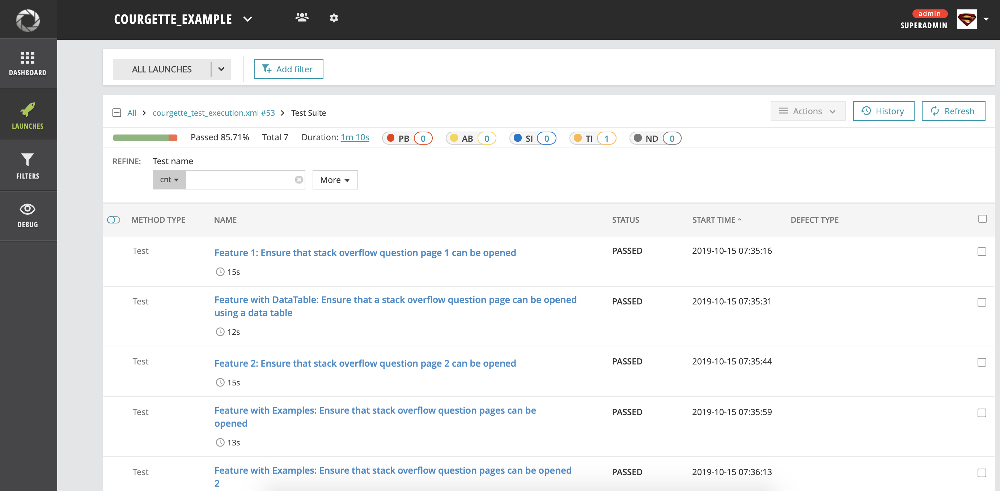
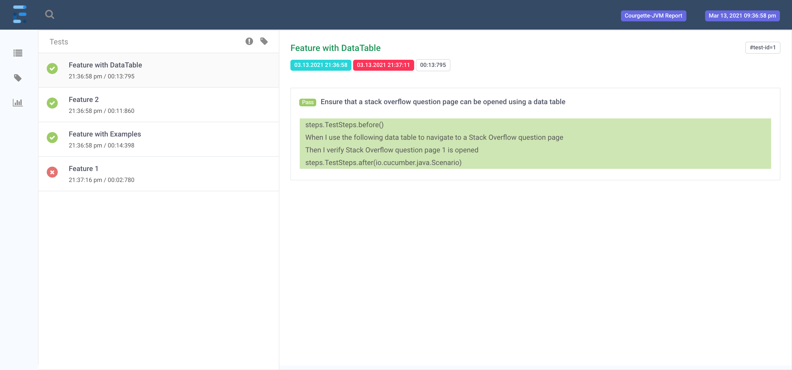

[](https://travis-ci.org/prashant-ramcharan/courgette-jvm)
[  ](https://bintray.com/prashantr/Courgette-JVM/courgette-jvm/_latestVersion)
[](https://search.maven.org/search?q=g:%22io.github.prashant-ramcharan%22%20AND%20a:%22courgette-jvm%22)
[](https://opensource.org/licenses/MIT)

# Courgette-JVM #

Courgette-JVM is an extension of Cucumber-JVM with added capabilities to **run cucumber tests in parallel on a feature level or on a scenario level**. It also provides an option to **automatically re-run failed scenarios**.

## Key Features
- **All features** can be executed in parallel on independent threads.
- **All scenarios** can be executed in parallel on independent threads.
- **Automatic re-run** of failed scenarios.
- **Requires only 1 annotated class** to run all feature files in parallel.
- **Single report generation** for all executed features including embedded files (Json and Html reports)
- **Single re-run file** listing all failed scenarios that occured during parallel execution.
- Supports **Cucumber-JVM 5**
- Supports **JUnit** and **TestNG**
- Integrates with **Extent Reports** to create interactive reports.
- Integrates with **Report Portal** to support AI powered dashboards.
- Can be used with **Gradle** and **Maven**.
- Searchable and paginated **Courgette-JVM Html Report** which includes all step definitions, embedded screenshots, thrown exceptions, pie chart and Courgette run information.


## Requirements
- Java 8
- Java 9 and 10 (_supported from version 2.3.1_)
- Java 11 (_supported from version 3.0.0_)

## Installation

#### Repository: [jcenter](https://bintray.com/bintray/jcenter?filterByPkgName=courgette-jvm)

<a href='https://bintray.com/prashantr/Courgette-JVM/courgette-jvm?source=watch' alt='Get automatic notifications about new "courgette-jvm" versions'></a>

#### Maven
````xml
<repositories>
    <repository>
      <id>jcenter</id>
      <url>https://jcenter.bintray.com/</url>
    </repository>
</repositories>

<dependency>
  <groupId>io.github.prashant-ramcharan</groupId>
  <artifactId>courgette-jvm</artifactId>
  <version>4.3.4</version>
</dependency>
````

#### Gradle
````gradle
repositories {
    jcenter()
}

compile 'io.github.prashant-ramcharan:courgette-jvm:4.3.4'
````

#### Included Dependencies
* cucumber-core 5.0.0-RC1
* cucumber-java 5.0.0-RC1
* cucumber-java8 5.0.0-RC1
* cucumber-junit 5.0.0-RC1
* cucumber-testng 5.0.0-RC1
* extent-reports 4.1.3
* jackson-databind 2.8.8
* httpcomponents-httpclient 4.5.10
* httpcomponents-httpmime 4.5.10


## Usage

Example projects:

* [Courgette-JVM Example](https://github.com/prashant-ramcharan/courgette-jvm-example)
* [Courgette-JVM with Selenium Example (_multiple browsers_)](https://github.com/prashant-ramcharan/courgette-jvm-selenium)

Courgette-JVM supports JUnit and TestNG to run cucumber features and scenarios in parallel. A JUnit runner class must be annotated with **@RunWith(Courgette.class)** and a TestNG runner class must extend **TestNGCourgette**.

* **threads** : The number of concurrent threads to run cucumber features. 

    * _Example: If you have 10 cucumber features and you use 6 threads, 6 features would first run in parallel then the following 4 features would run in parallel_.

* **runLevel** : Options are CourgetteRunLevel.FEATURE or CourgetteRunLevel.SCENARIO

    * _If set to feature level, all features would run in parallel. If set to scenario level, all scenarios would be run in parallel._
    
* **rerunFailedScenarios** : If set to true, any failed scenario will be immediately re-run in the same thread. If the re-run succeeds, the initial failure will be ignored and not cause the build to fail.

* **rerunAttempts** : The number of re-run attempts for a failed scenario. (_rerunFailedScenarios must be set to true_)

* **showTestOutput** : If set to true, the output for each feature will be redirected to the current I/O source or destination.

* **reportTargetDir** : Target directory where courgette-report is generated. Set to target by default.

* **shortenJavaClassPath** : If set to true, the project jars will be copied to a temp directory to shorten the classpath. [Java 8 Only]

* **plugin** : Courgette supported plugins
    
    * _reportportal: Allows the test results to be published to [Report Portal](https://reportportal.io/) at the end of the test run._
    * _extentreports: Creates an interactive report based on the [Extent Framework](http://extentreports.com/)_
    
* **cucumberOptions** : The standard cucumber options for specifying feature paths, glue, tags etc..

### Additional

* At the end of the test run, a **single report** ( _if included in the cucumberOptions_ ) listing all executed features and scenarios will be created in the specified report path. All embedded images will be placed in the images folder in the specified report path.

* A **courgette-rerun.txt** file listing all failed scenarios will be created in the specified rerun plugin path or the target folder ( _default_ )

* A Courgette-JVM Html report will be created in the reportTargetDir (_defaulted to the target directory_).

##### JUnit Runner

````java
@RunWith(Courgette.class)
@CourgetteOptions(
        threads = 10,
        runLevel = CourgetteRunLevel.SCENARIO,
        rerunFailedScenarios = true,
        rerunAttempts = 1,
        showTestOutput = true,
        reportTargetDir = "build",
        cucumberOptions = @CucumberOptions(
                features = "src/test/resources/features",
                glue = "steps",
                tags = {"@regression", "not @wip"},
                plugin = {
                        "pretty",
                        "json:build/cucumber-report/cucumber.json",
                        "html:build/cucumber-report/cucumber.html",
                        "junit:build/cucumber-report/cucumber.xml"},
                strict = true
        ))
public class RegressionTestSuite {
}
````


##### TestNG Runner

````java
@Test
@CourgetteOptions(
        threads = 10,
        runLevel = CourgetteRunLevel.SCENARIO,
        rerunFailedScenarios = true,
        rerunAttempts = 1,
        showTestOutput = true,
        reportTargetDir = "build",
        cucumberOptions = @CucumberOptions(
                features = "src/test/resources/features",
                glue = "steps",
                tags = {"@regression", "not @wip"},
                plugin = {
                        "pretty",
                        "json:build/cucumber-report/cucumber.json",
                        "html:build/cucumber-report/cucumber.html"},
                strict = true
        ))
public class RegressionTestSuite extends TestNGCourgette {
}
````


## Gradle Build Task

````gradle
tasks.withType(Test) {
    systemProperties = System.getProperties()
    systemProperties.remove("java.endorsed.dirs") // needs to be removed from Java 9
}

// JUnit
task regressionSuite(type: Test) {
    include '**/RegressionTestSuite.class'

    outputs.upToDateWhen { false }
}

// TestNG
task regressionSuite(type: Test) {
    useTestNG()

    include '**/RegressionTestSuite.class'

    outputs.upToDateWhen { false }
}
````

## Gradle Run Options

To override the hard-coded courgette options (_threads, runLevel, rerunFailedScenarios, showTestOutput, reportTargetDir_) set in the runner class, you can provide system properties to the gradle task.

````gradle

gradle regressionSuite -Dcourgette.threads=2 -Dcourgette.runLevel=FEATURE -Dcourgette.rerunFailedScenarios=false -Dcourgette.showTestOutput=true -Dcourgette.reportTargetDir=build

````

To override the hard-coded cucumber options (_tags, glue, plugin, name, junit_) set in the runner class, you can provide comma separated system properties to the gradle task.

````gradle

gradle regressionSuite -Dcucumber.tags="@regression, ~@bug" -Dcucumber.glue="steps, hooks"

````

To specify non standard VM options (_-X options_)

````gradle

gradle regressionSuite -Dcourgette.vmoptions="-Xms256m -Xmx512m"

````

## JUnit Callbacks

You can add global setup and tear-down code to your Courgette test runner using the `@CourgetteBeforeAll` and `@CourgetteAfterAll` annotations. For example:

```java
@RunWith(Courgette.class)
@CourgetteOptions(/* Your Courgette options here... */)
public class RegressionTestSuite {
    @CourgetteBeforeAll
    public static void setUp() {
        System.out.println("I will run before any tests execute");
    }
    
    @CourgetteAfterAll
    public static void tearDown() {
        System.out.println("I will run after all of the tests execute");
    }
}
```

You can add any number of annotated methods to your test suite class. 
If you need your callbacks to run in a specific order, pass `order` to the annotation: `@CourgetteBeforeAll(order = 2)`.

## Report Portal Integration

Courgette allows test results to be published to the [Report Portal](https://reportportal.io/) server at the end of the test run. 

To enable this feature, add the following Courgette option to the Courgette runner:

````java
@CourgetteOptions(
      ...  
      plugin = { "reportportal" },
      cucumberOptions = @CucumberOptions(
      // cucumber options here
      )
)
````

You must have the **reportportal.properties** file in your classpath and the following properties must be defined:
````properties
# Report Portal server (mandatory)
rp.endpoint = http://localhost:8080

# Report Portal project (mandatory)
rp.project = courgette_example

# Report Portal API access token (mandatory)
rp.apitoken=a1e5ee78-317c-477d-b27e-f174c562aedc

# Report Portal launch name (optional)
rp.launch= My Demo Project

# Report Portal test suite (optional)
rp.testsuite= Smoke Test Suite
````

An API access token is required to allow Courgette to publish the report. To obtain an API access token, log in to Report Portal UI and navigate to http://localhost:8080/ui/#api -> UAT -> sso-endpoint -> Get api token

After the test run is complete, the test results will be published to the Report Portal server.




## Extent Reports Integration

Courgette allows the creation of interactive reports using the Extent Reports Courgette plugin.

To enable this feature, add the following Courgette option to the Courgette runner:

````java
@CourgetteOptions(
      ...  
      plugin = { "extentreports" },
      cucumberOptions = @CucumberOptions(
      // cucumber options here
      )
)
````

At the end of the test run the report will be saved to `${reportTargetDir}/courgette-extentreports` 

To configure custom reports (_i.e. change the report name or theme_) you should create the `extent-config.xml` file in the classpath. Courgette will load this XML config when it builds the report. If this file is not provided then default values will be used. View an example [here](https://github.com/prashant-ramcharan/courgette-jvm-example/blob/master/src/test/resources/extent-config.xml)




## Limitations and Known Issues

* JUnit test notifier is not updated when running features in the IDE during parallel test execution.
   
   * _Each feature is run using the Cucumber CLI and because of this JUnit is not notified off the test result. The workaround to this is the Courgette-JVM html report which lists all test passes, failures and re-runs. Alternatively, you can review the Cucumber reports or the results from the build tool_.
   
  
* When there's a failure in the feature and your runner is set to 'runLevel = CourgetteRunLevel.FEATURE' and 'rerunFailedScenarios = true', the re-run cucumber feature report will override the original cucumber feature report.
   
   * _Use CourgetteRunLevel.SCENARIO which resolves this issue and retains all results in the cucumber report._


* The following error is returned: "java.io.IOException: Cannot run program "java": CreateProcess error=206, The filename or extension is too long" [Windows OS Only]
    * _This is a known Windows Create Process issue and is related to the classpath exceeding the maximum length of 32K characters. To workaround this, please upgrade to either Java 9/10/11 and Courgette 3.0.0 as Courgette uses the Java Platform Module System instead of the URL classloader._
    * _Set Courgette option 'shortenJavaClassPath = true' [implemented in Courgette version 4.3.4]_


## Submitting Issues
For any issues or requests, please submit [here](https://github.com/prashant-ramcharan/courgette-jvm/issues/new)
